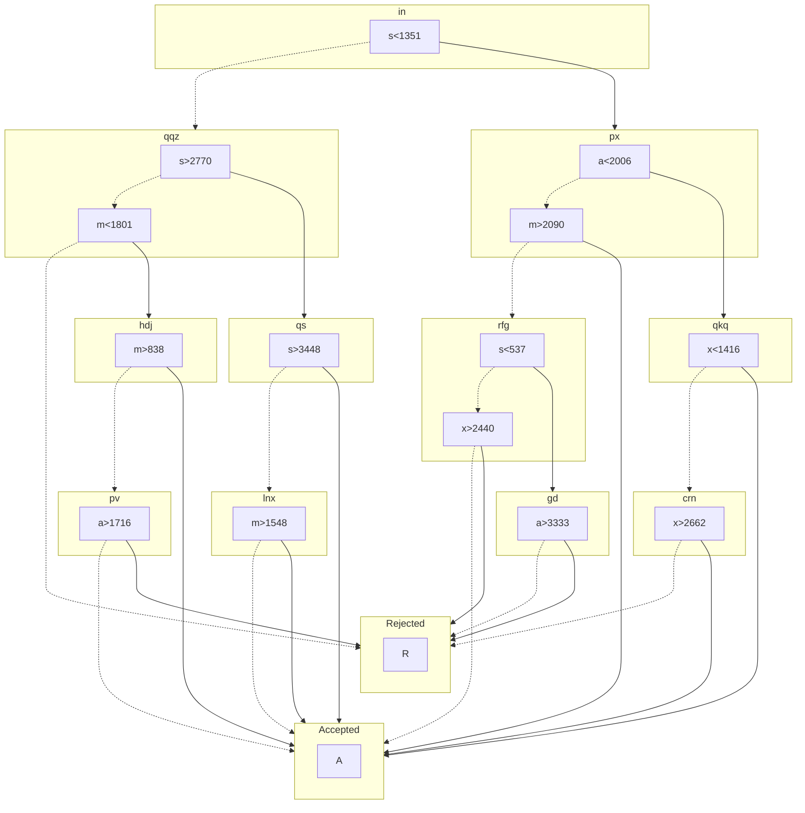

```mermaid
graph TD
    subgraph in
        in_1[s<1351]
    end
    in_1 -..-> qqz
    in_1 ---> px


    subgraph px
        px_1[a<2006] -.-> px_2[m>2090]
    end
    px_2 -..-> rfg
    px_1 ---> qkq
    px_2 ----> Accepted

    subgraph qqz
        qqz_1[s>2770] -.-> qqz_2[m<1801]
    end
    qqz_2 -..-> Rejected
    qqz_1 ---> qs
    qqz_2 ---> hdj

    subgraph qkq
        qkq_1[x<1416]
    end
    qkq_1 -..-> crn
    qkq_1 ----> Accepted

    subgraph rfg
        rfg_1[s<537] -.-> rfg_2[x>2440]
    end

    rfg_1 ---> gd
    rfg_2 -...-> Accepted
    rfg_2 ---> Rejected

    subgraph qs
        qs_1[s>3448]
    end
    qs_1 -..-> lnx
    qs_1 ----> Accepted

    subgraph hdj
        hdj_1[m>838]
    end
    hdj_1 -..-> pv
    hdj_1 ----> Accepted

    subgraph crn
        crn_1[x>2662]
    end
    crn_1 -..-> Rejected
    crn_1 ----> Accepted

    subgraph gd
        gd_1[a>3333]
    end
    gd_1 -..-> Rejected
    gd_1 ---> Rejected

    subgraph lnx
        lnx_1[m>1548]
    end
    lnx_1 -...-> Accepted
    lnx_1 ----> Accepted

    subgraph pv
        pv_1[a>1716]
    end
    pv_1 -...-> Accepted
    pv_1 ---> Rejected

    subgraph Rejected
        R
    end

    subgraph Accepted
        A
    end
```